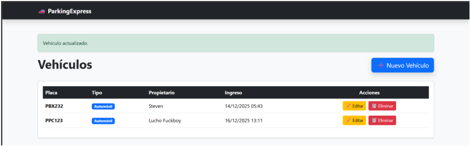
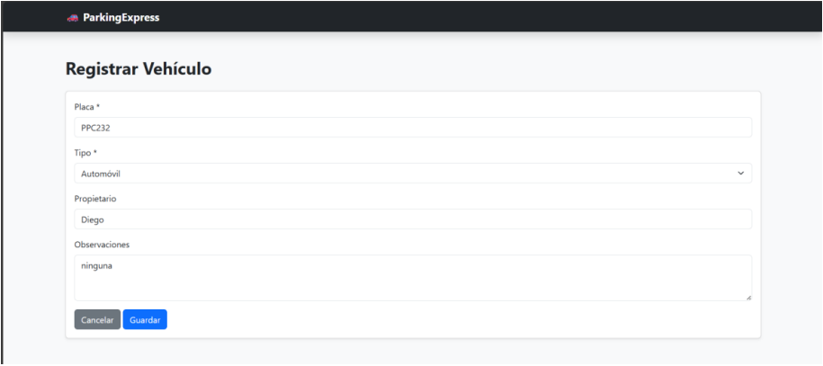
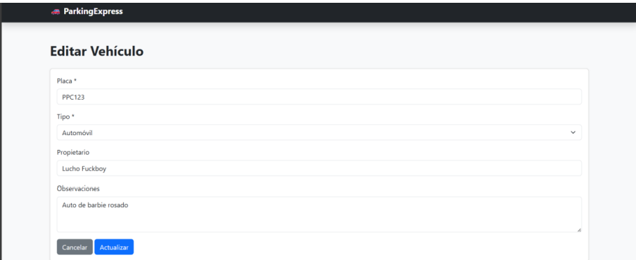
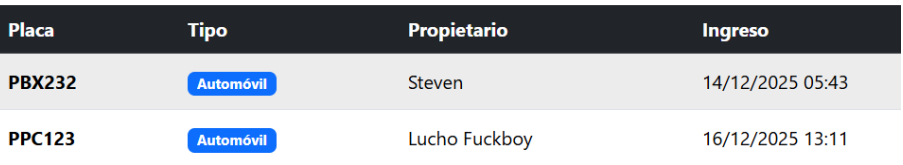
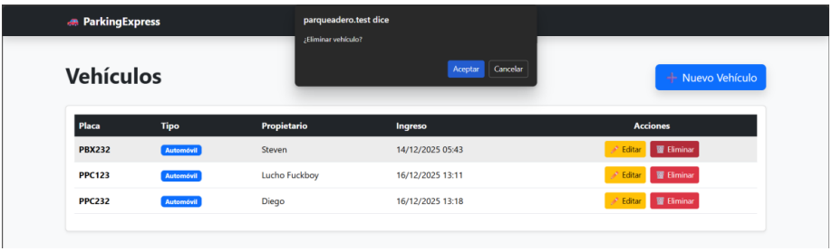
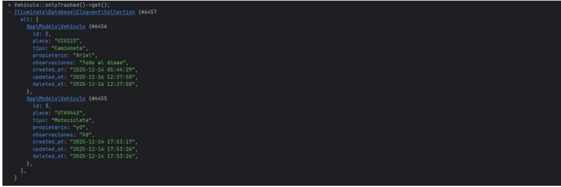
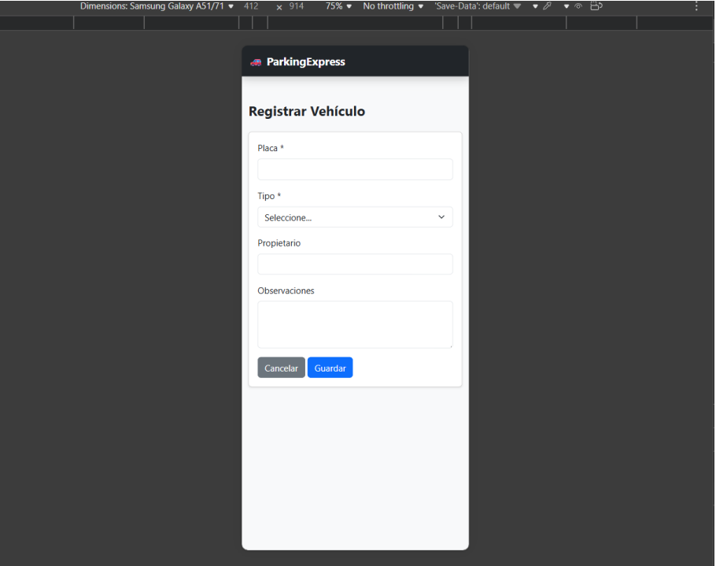

# 🚗 Sistema Parking Express - MVC

## 📌 Descripción del Proyecto

Este proyecto implementa un **CRUD (Create, Read, Update, Delete)** para la gestión de vehículos, desarrollado con **Laravel** y orientado a buenas prácticas de desarrollo, trazabilidad de datos y documentación clara.

El sistema permite registrar, visualizar, editar y eliminar vehículos, aplicando una **política de eliminación lógica (Soft Delete)** para garantizar la integridad y el historial de la información.

---

## 🛠️ Tecnologías Utilizadas

* **Laravel** (Framework backend)
* **Laravel Herd** (Entorno de desarrollo)
* **MySQL / PostgreSQL** (Base de datos relacional)
* **Bootstrap 5** (Diseño responsive)
* **GitHub** (Control de versiones)

---

## 📂 Estructura del Proyecto

El proyecto sigue la estructura estándar de Laravel, destacando:

* `app/Models` → Modelo `Vehiculo`
* `app/Http/Controllers` → Controlador del CRUD
* `resources/views` → Vistas Blade
* `database/migrations` → Migración de la tabla vehículos
* `routes/web.php` → Rutas del sistema

---

## 🗄️ Diseño de Base de Datos

### 📋 Tabla: **vehiculos**

| Campo         | Tipo      | Obligatorio |
| ------------- | --------- | ----------- |
| id            | BIGINT    | Sí          |
| placa         | VARCHAR   | Sí          |
| tipo          | VARCHAR   | Sí          |
| propietario   | VARCHAR   | Sí          |
| observaciones | TEXT      | No          |
| created_at    | TIMESTAMP | Sí          |
| updated_at    | TIMESTAMP | No          |
| deleted_at    | TIMESTAMP | No          |

La columna `deleted_at` permite aplicar la política de **Soft Delete**, evitando la eliminación física de los registros.

---

## 🚙 Tipos de Vehículos

| Tipo de Vehículo | Descripción                                                                              |
| ---------------- | ---------------------------------------------------------------------------------------- |
| Automóvil        | Vehículo de uso particular con cuatro ruedas, destinado al transporte de personas.       |
| Moto             | Vehículo de dos ruedas, ágil y de menor tamaño.                                          |
| Camioneta        | Vehículo de mayor capacidad, utilizado para transporte mixto de personas o carga ligera. |

---

## 🔎 Validaciones Implementadas

El sistema cuenta con validaciones básicas para garantizar la integridad de la información:

- El campo **placa** es obligatorio y único.
- El campo **tipo de vehículo** es obligatorio.
- El campo **propietario** es obligatorio.
- El campo **observaciones** es opcional.
---

## 🧹 Política de Eliminación de Datos

✔ **Sí, se pueden eliminar registros**.

El sistema utiliza una **política de eliminación lógica (Soft Delete)**, lo que significa que:

* Los registros no se eliminan físicamente de la base de datos.
* Se marcan como eliminados mediante el campo `deleted_at`.
* Se conserva el historial de información.
* Se garantiza la trazabilidad y recuperación de datos si es necesario.

Esta política es ideal para sistemas administrativos donde la información no debe perderse definitivamente.

---

## 📱 Interfaz de Usuario

* Diseño **responsive** usando Bootstrap 5.
* Compatible con dispositivos móviles y de escritorio.
* Formularios claros y validaciones básicas para evitar errores de ingreso.

---

## 🔧 Instalación y Ejecución

### 📤 Subir cambios a GitHub

Una vez finalizado el desarrollo del CRUD, se deben guardar y subir los cambios al repositorio público en GitHub.

Ejecutar los siguientes comandos desde la raíz del proyecto:

```bash
git add .

git commit -m "CRUD Parqueadero completo"

git push
```

Luego de ejecutar estos comandos, se puede verificar que el repositorio se encuentre actualizado ingresando a la URL del repositorio en GitHub.

---

## 🧠 Decisiones Técnicas

- Se utilizó **Laravel** como framework principal debido a su arquitectura MVC, facilidad de mantenimiento y soporte para buenas prácticas de desarrollo.
- Se implementó **Bootstrap 5** para garantizar un diseño responsive y compatible con distintos dispositivos.
- Se aplicó una política de **eliminación lógica (Soft Delete)** para preservar la trazabilidad y el historial de los datos.
- La estructura del proyecto sigue la organización estándar de Laravel para facilitar su escalabilidad y comprensión.
---

## 🗂️ Resumen de Archivos y Estructura del Proyecto

```text
app/
├── Models/
│   └── Vehiculo.php
├── Http/
│   └── Controllers/
│       └── VehiculoController.php

resources/
├── views/
│   ├── layouts/
│   │   └── app.blade.php
│   └── vehiculos/
│       ├── index.blade.php
│       ├── create.blade.php
│       └── edit.blade.php

routes/
└── web.php

database/
└── migrations/
    └── xxxx_xx_xx_create_vehiculos_table.php

capturas/
├── listado.png
├── formulario.png
└── movil.png
```

Esta estructura sigue las buenas prácticas de Laravel, separando correctamente modelos, controladores, vistas, rutas y migraciones, lo que facilita el mantenimiento y la escalabilidad del proyecto.

---

## 🧹 Política de Eliminación de Datos

1. Clonar el repositorio:

```bash
git clone https://github.com/usuario/nombre-repositorio.git
```

2. Instalar dependencias:

```bash
composer install
cp .env.example .env
php artisan key:generate
php artisan migrate
php artisan serve
```

---

## 📌 Consideraciones Finales

Este proyecto fue desarrollado con un enfoque académico y práctico, priorizando:

* Organización del código
* Buenas prácticas en Laravel
* Documentación clara
* Facilidad de mantenimiento y escalabilidad

---

## 🖼️ Evidencias del Sistema

A continuación, se presentan evidencias visuales del correcto funcionamiento del sistema **Parking Express – MVC**, demostrando el cumplimiento de los requisitos funcionales y técnicos del CRUD.

---

### 📋 Listado de Vehículos
Visualización general de los vehículos registrados en el sistema.



---

### 📝 Registro de Vehículos
Formulario para el ingreso de nuevos vehículos con validaciones aplicadas.



---

### ✏️ Edición de Vehículos
Pantalla de edición para la actualización de información de un vehículo existente.



---

### ⏱️ Registro Automático de Fecha y Hora
Evidencia del registro automático de fecha y hora al crear un vehículo.



---

### 🧹 Política de Eliminación Lógica (Soft Delete)
Demostración de la política de eliminación lógica aplicada a los registros del sistema.



---

### 🗃️ Registros Eliminados en Base de Datos
Visualización de los registros eliminados lógicamente almacenados en la base de datos.



---

### 📱 Vista Móvil (Responsive)
Adaptación del sistema a dispositivos móviles utilizando Bootstrap 5.



---

Las capturas se encuentran almacenadas en la carpeta `/screenshots` del repositorio.
--

## 👨‍💻 Autor

<p align="center">
  <strong>Steven Ariel Rosero</strong><br>
  <em>Haciendo que el sistema funcione, a base de fe y café ☕</em><br>
  Estudiante de Ingeniería en Sistemas<br>
  Pontificia Universidad Católica del Ecuador
</p>

<p align="center">
  
</p>


---

📎 *Repositorio público disponible en GitHub conforme a los requisitos del proyecto.*
